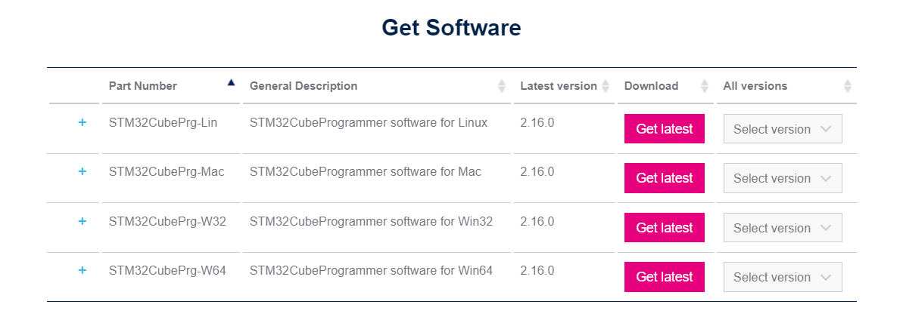

# EMPA-Workshop-Oncesi-Kurulacaklar

EMPA Workshop Öncesi Yapılacaklar / Kurulumlar
Bu dokümantasyonda etkinlik öncesi gerekli programların ve paketlerin kurulumları anlatılacaktır. Kurulması gereken program ve paketler şu şekildedir:

1. [STM32CubeIDE](https://www.st.com/en/development-tools/stm32cubeide.html)
2. [STM32CubeMX](https://www.st.com/en/development-tools/stm32cubemx.html)
3. [STM32CubeProgrammer](https://www.st.com/en/development-tools/stm32cubeprog.html)
4. [TeraTerm](https://github.com/TeraTermProject/teraterm/releases)
5. SW Paketleri

# 1- STM32CubeIDE Kurulumu

STM32CubeIDE, STM32 mikrodenetleyicileri ve mikroişlemcileri için gerekli çevresel yapılandırmaların yapılmasını, kod oluşturma ve derlemeyi, kodun hata ayıklama işlemlerini ve cihaza yüklenmesini sağlayan Eclipse tabanlı bir C/C++ geliştirme platformudur.

Öncelikle STMicroelectronics’nin sitesinden STM32CubeIDE 1.15.1 versiyonunu indiriniz.
Aşağıdaki seçenekler arasından işletim sisteminize uygun olanı indirip kurulumunu gerçekleştirin.
 

  

 

NOT 1: Kurulum yapacağınız hedef klasör (Destination folder) yolunda Türkçe karakter ve boşluk olmadığına dikkat ediniz.

NOT 2: Kurulum sırasında ST-LINK ve SEGGER J-Link sürücülerinin yüklenip yüklenmeyeceği sorulacaktır. Bu sürücüleri seçip yükleme işlemlerine devam ediniz.

# 2- STM32CubeMX Kurulumu

STM32CubeMX, STM32 mikrodenetleyicileri ve mikroişlemcileri için model seçimlerinin, başlangıç konfigürasyonlarının ve clock ayarlarının kolayca yapılmasını sağlayan, başlangıç kodlarını oluşturan grafik destekli bir araçtır. Bu araç, adım adım ilerleyen bir süreçle STM32 cihazlarının yapılandırılmasını ve gerekli başlatma C kodunun oluşturulmasını sağlar.

Öncelikle STMicroelectronics’in [sitesinden](https://www.st.com/en/development-tools/stm32cubemx.html) **STM32CubeMX 6.11.1** versiyonunu indiriniz.
Aşağıdaki seçenekler arasından kendi işletim sisteminiz için uygun olanı seçip indiriniz ve kurulumunu yapınız.
 

  

 

# 3- STM32CubeProgrammer Kurulumu

STM32CubeProgrammer, STM32 mikrodenetleyicileri programlama ve konfigürasyonlarını ayarlamak için tasarlanmış grafiksel bir araçtır.
 Öncelikle STMicroelectronics’in [sitesinden](https://www.st.com/en/development-tools/stm32cubeprog.html) **STM32CubePrg 2.16.0** versiyonunu indiriniz.

 

  

 

# 3- Tera Term Kurulumu
Tera Term, kullanıcıların seri port iletişimi sağlayarak uzak bilgisayarlara erişmelerine ve UART gibi çeşitli iletişim protokolleri aracılığıyla cihazlarla iletişim kurmalarına olanak tanır. Bilgisayar ile geliştirme kartı arasında UART üzerinden iletişim sağlamak için bu program kullanılacaktır.
Github [sayfasından](https://github.com/TeraTermProject/teraterm/releases) Assets altından dosyasını indiriniz ve kurulumu gerçekleştiriniz. 

  

 

# 4- SW Paketlerinin Kurulumu

Uygulamalarda STM32U5 ailesinden bir mikrodenetleyici kullanılacağı için U5 paketlerinin indirilmesi gereklidir. 
Öncelikle STM32CubeIDE programını başlatınız.

Açılan STM32CubeIDE uygulaması içerisinde **Help** sekmesi altında **Manage Embedded Software Packages**'a tıklayınız.

  

 

Ardından **STM32Cube MCU Packages** sekmesi altında **STM32U5->STM32Cube MCU Package for STM32U5 Series** yanındaki **1.5.0** sürümününün kutucuğunu işaretleyiniz ve install'a tıklayarak yükleme işlemini gerçekleştiriniz.  

  

 
Ek olarak STMicroelectronics’in internet <a href="https://www.st.com/en/embedded-software/stm32cubeu5.html">sitesinden</a> STM32CubeU5 dosyasını indiriniz.
 

  

 

# 5-A) X-CUBE-ISPU Yazılım Paketi Kurulumu 
X-CUBE-ISPU yazılım paketinin yüklenmesi için STM32CubeIDE uygulaması içerisinde **Help** sekmesi altında **Manage Embedded Software Packages**'a tıklayınız.
 

  

 

Açılan ekranda yukarıdaki sekmelerden STMicroelectronics (1) seçilir. Ardından paketlerden X-CUBE-ISPU (2) paketi seçilir. Ve **2.0.0 versiyonunun** yanındaki kutucuk (3) işaretlenir. Ve install (4)'a tıklanarak indirme işlemi başlatılır. Yükleme işlemi sırasında kullanıcı girişinin yapılmış olması gerekmektedir. Paketin yüklenme işlemi tamamlanmıştır. 

 

  

 

# 5-B) X-CUBE-AI Yazılım Paketi Kurulumu 
X-CUBE-AI yazılım paketinin yüklenmesi için STM32CubeIDE uygulaması içerisinde **Help** sekmesi altında **Manage Embedded Software Packages**'a tıklayınız.
 

  

 

Açılan ekranda yukarıdaki sekmelerden STMicroelectronics (1) seçilir. Ardından paketlerden X-CUBE-AI (2) paketi seçilir. Ve **9.0.0 versiyonunun** yanındaki kutucuk (3) işaretlenir. Ve install (4)'a tıklanarak indirme işlemi başlatılır. Yükleme işlemi sırasında kullanıcı girişinin yapılmış olması gerekmektedir. Paketin yüklenme işlemi tamamlanmıştır. 

 

  

 

Gerekli kurulumlar tamamlanmıştır.
